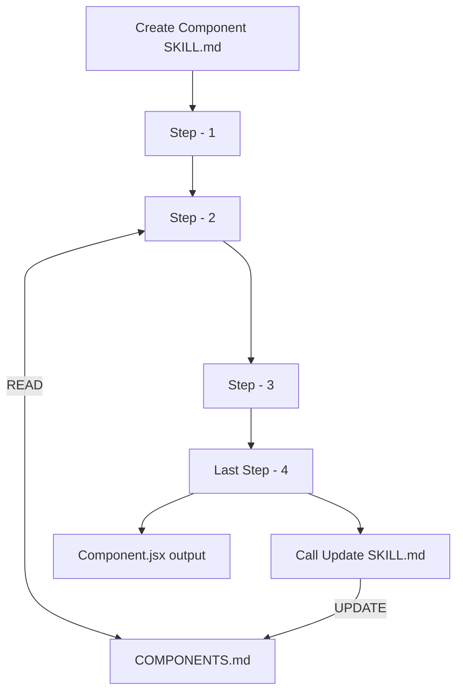

Since I began to work with SDD (Spec Driven Development) a few months ago I've been trying to create a productivity workflow in the projects I'm currently working on.

In the beginning it was really a pain and a lot of time I've got thinking "Am I doing something wrong?", "Are Figma MCP and Claude really capable of handling a good implementation?"

Fast-forward to today and I can say it was a little of both. Figma and Claude indeed got better at handling UI implementation, but the real deal was when I got the time to invest on my project's **harness**, **context**, and agent **documentation narrative**.

<Callout
  title="What are harnesses in agentic development?"
  text="We can consider harness as the infrastructure layer surrounding our AI model/agent. It's the combination of context, usable tools, how to produce expected outputs of code and what to do if something goes outside of the plan from the execution scope.
"
/>

So, this article is a compilation of experiences from the past 4 to 5 months on my personal journey to understand how to create a healthy agentic development workflow for front-end applications.

<ArticleTitle tag="h2">Building UI for brands is different from just building a UI.</ArticleTitle>

When the AI boom started it felt that front-end applications would be the most impacted because of how the speech to just go and use **Tailwind** or **Shadcn** (or one of its million clones) was going to be easy.

And I quickly learned that this reality can be really different when you have a design system for a product that needs to be consistent in the UI quality for a set of well defined style guides.

So the first implementations were a nightmare.

When my team started to implement SDD workflows the first executions of tasks with Claude and Figma MCP were clearly an experience. The agent could not understand our existing components or layouts in relation to my Figma files, the CSS Token usage was terribly low, it poorly handled assets such as SVGs or images and the UI consistency was really a mess.

After some weeks fighting against the agent implementation I've searched for better approaches and understand more about the importance of good context, harness, rules files with Claude and how to create a good narrative Skills for the agent execution. Here, the game has changed.

<ArticleTitle tag="h2">The AGENTS.md context file</ArticleTitle>

`AGENTS.md` is a context file that lives in the root of the repository, dedicated to guide agents on how to use your project. It's like the `README.md` file, but for AI.

You don't need to give business context on this file, here we want to focus on the **execution of your application, its dependencies, existing code and development patterns**.

I like to divide this file on topics to explain my full work environment.

<Accordion title="Tech Stack">

```markdown
## Language & technology

- **Primary languages:** TypeScript
- **Runtime versions:** Node.js (no pin — see `package.json` peer deps)
- **Package managers:** yarn
- **Frameworks / load-bearing libs:** Next.js 16.2.6, React 18.2.0, TypeScript 6.0.2, TanStack Form, TanStack Query
- **Linter:** [oxlint](https://oxc.rs/docs/guide/usage/linter)
- **Formatter:** [oxfmt](https://github.com/nicolo-ribaudo/oxfmt)

```

</Accordion>

<Accordion title="Package Scripts">

```markdown
## Package Scripts

- **Build:** `yarn build:development` / `yarn build:staging` / `yarn build:production`
- **Run (local dev):** `yarn start` (Express + Next.js dev server)
- **Linter:** `yarn lint` (check), `yarn lint --fix` (auto-fix)
- **Formatter:** `yarn fmt:check` (check), `yarn fmt` (auto-format)

```

</Accordion>

<Accordion title="Rules">

```markdown
## Rules (enforced, not preferences)

These are house rules. If a change violates one, fix the change — don't
relax the rule. Rules live in [`.claude/rules/`](.claude/rules/); add a new
rule by adding a new file and a row here.

- **[COMPONENTS.md](.claude/rules/COMPONENTS.md)** — authoritative map of
  every reusable component and layout in `src/components` and `src/layouts`.
  Read before generating or editing any UI code.
- **[ICONS.md](.claude/rules/ICONS.md)** — icon library reference: all SVG
  icons in `public/svg/icons/`, filename→concept mapping. Always pick from
  this list before creating a new icon.
- **[TOKENS.md](.claude/rules/TOKENS.md)** — authoritative reference for all
  CSS custom properties in `src/styles/tokens.scss`. Use tokens; never
  hardcode color, spacing, or typography values.

```

</Accordion>

<Accordion title="Skills and Slash Commands">

```markdown
## Skills and Slash Commands

| Scaffold a new component or layout    | [`.claude/skills/add-component.md`](.claude/skills/add-component.md)                      |
| Add a new SVG icon                    | [`.claude/skills/add-svg-icon.md`](.claude/skills/add-svg-icon.md)                        |
| Convert a Figma frame to code         | [`.claude/skills/figma-to-code.md`](.claude/skills/figma-to-code.md)                      |
| Give feedback on a finished agent run | [`.claude/skills/give-feedback/SKILL.md`](.claude/skills/give-feedback/SKILL.md)          |
| Set up design-system components       | [`.claude/skills/setup-components/`](.claude/skills/setup-components/)                    |
| Set up / sync CSS design tokens       | [`.claude/skills/setup-css-tokens/`](.claude/skills/setup-css-tokens/)                    |

```

</Accordion>

<Accordion title="Verification Loop">

A set of scripts to validate the environment after tasks

```markdown
## Verification loop

Run locally before pushing (mirrors CI):

```sh
yarn fmt:check          # oxfmt — formatter check, must be clean
yarn fmt                # oxfmt — auto-format (run before committing)
yarn lint               # oxlint — zero errors required
yarn lint --fix         # oxlint — auto-fix safe violations
yarn build:development  # build sanity check (required in CI)

```               

</Accordion>

<Accordion title="When Stuck">

This one was a friend recommendation and I like the idea. It's a more narrative way to explain what to do if the agent is stuck on a decision.

  ```markdown
## When stuck

- Workspace context: `../CLAUDE.md`
- Org workflow docs: `https://github.com/my-org/ai-workflow/`
- Components guide: [`.claude/rules/COMPONENTS.md`](.claude/rules/COMPONENTS.md)
- Icons guide: [`.claude/rules/ICONS.md`](.claude/rules/ICONS.md)
- Tokens guide: [`.claude/rules/TOKENS.md`](.claude/rules/TOKENS.md)
- Next.js docs: `https://nextjs.org/docs`

```               

</Accordion>

With this solid base of guidelines I've begun to improve the harness of my application and to have a more rich context for the agent to code.

<ArticleTitle tag="h2">Harness to create a consistent output</ArticleTitle>

Working with Claude we have a `.claude/rules/` folder, and initially I used it as my harness for code implementation. Other agents have a similar approach and with SDD workflows, like <a href="https://openspec.dev/" target="_blank">OpenSpec</a> you can create a live documentation for context and harness.

But let's focus on the Claude rules. With them I like to create a narrative documentation on the follow structure:

- A **title** and a **short explanation** of the usage of the rule
- A **scope of usage**, for example, to limit folders context
- **How** and **when** the rule should be updated
- The rule itself

Some examples:

<Accordion title="COMPONENTS.md">

  ```markdown
# Component & Layout Guide

This document is the authoritative reference for all reusable components and
shared layout primitives. Read it before generating or editing any UI code so
you pick the right building block instead of inventing a new one.

**Scope:**

- `src/components` — atomic, page-agnostic components
- `src/layouts/Shared` — shared layout primitives reused across layouts

**Out of scope (not tracked here):**

- `src/layouts/<OtherLayout>/components/` — layout-private nested components
- `src/layouts/<OtherLayout>/sections/` — layout-specific sections
- Any other sub-folder inside a specific layout

## Quick-reference map

| Need to…                                | Use                |
| --------------------------------------- | ------------------ |
| Show collapsible Q&A items              | `Accordion`        |
| Render a feature/benefit card with icon | `ActionCard`       |
| Bind a form field with TanStack Form    | `InputField`       |

---

## Components (`src/components`)

### Accordion

**File:** `src/components/Accordion/index.tsx`

Collapsible content block built on the native HTML `<details>`/`<summary>`
elements. Uses a compound-component pattern.

	
import Accordion from "@/components/Accordion";

<Accordion name="faq">
  {" "}
  {/* name groups items so only one opens at a time */}
  <Accordion.Summary>Question text</Accordion.Summary>
  <Accordion.Content>Answer text or any ReactNode</Accordion.Content>
</Accordion>;
	

**Props — `Accordion`**

| Prop       | Type                  | Required | Description                                            |
| ---------- | --------------------- | -------- | ------------------------------------------------------ |
| `children` | `string \| ReactNode` | yes      | Must include `Summary` and `Content` sub-components    |
| `name`     | `string`              | no       | HTML `name` attribute; groups exclusive-open behaviour |

Sub-components `Accordion.Summary` and `Accordion.Content` accept only
`children: string | ReactNode`.

The `<summary>` automatically renders a `+` / `−` toggle icon — do not add
your own.

  ```
  
</Accordion>

<Accordion title="ICONS.md">

  ```markdown
# Icon Library

Icons are SVG files located in `public/svg/icons/`. Each file can be
imported and rendered as a JSX element. Use the list below to match a desired
icon concept to the correct filename.

## Available Icons

| File                     | Description / Use case                                        |
| ------------------------ | ------------------------------------------------------------- |
| `arrow-left.svg`         | Back navigation, previous, left direction                     |
| `calculator.svg`         | Calculator, simulator, economy tool                           |
| `hand-shake.svg`         | Handshake , partnership, referral link                        |

## Usage

Import the SVG as a React component (Next.js / SVGR pattern):

import ArrowRight from "@public/svg/icons/arrow-right.svg";

// Render inline
<ArrowRight />;

  ```
  
</Accordion>

Maybe you are asking yourself now, as I asked myself: Why do I need rules for components, icons or tokens, when the agent could simply read my files?

<ArticleTitle tag="h2">I'ts all about narrative</ArticleTitle>

I said that I like to create narrative rules, but actually every document for agent development should have a narrative for its context and code usage.

Whenever you want to execute a task with an agent, unless you want to explore solutions or brainstorm ideas, you would like **to plan exactly what you want as an output**.

For example, let's say we ask for a prompt for the agent to create a new UI component from a Figma section link, without well defined rules. In the best scenario the agent will begin to map every file in the context of your application, using an unnecessary amount of tokens to understand: what is that file, if its content fits the proposed prompt and how it can use it.

```mermaid
graph LR
    A[Claude Input] --> B[Figma MPC]
    B --> C[Read Files]
    C --> D[src/components]
    D --> DA[ComponentA.jsx]
    D --> DB[ComponentB.jsx]
    D --> DC[ComponentC.jsx]
    C --> E[src/styles/tokens.scss]
    E --> EA["`token-a: #123
    token-b: #456
    token-c: #789
    `"]
    C --> F[public/icons]
    F --> FA[icon-a.svg]
    F --> FB[icon-b.svg]
    F --> FC[icon-c.svg]
  ```

I say the best scenario because the agent could simply ignore the actual files and just create new code, without looking for existing implementations before.

Now let's look on a well documented rules workflow.

```mermaid
graph LR
    A[Claude Input] --> B[Figma MPC]
    B --> C[Read AGENTS.md]
    C --> D[COMPONENTS.md]
    D --> DA["`ComponentA: He Does A
    ComponentB: He does B
    ComponentC: He does C
    `"]
    C --> E[TOKENS.md]
    E --> EA["`
    Border-radius Tokens:
    token-a: 4px
    token-b: 8px

    Color Tokens:
    token-c: #123
    token-d: #456
    `"]
    C --> F[ICONS.md]
    F --> FA["`
    Icons list
    icon-a: Explain the icon
    icon-b: Explain the icon
    

    How to use the icon:
    // other code
    `"]
```

The difference of the approaches will affect the amount of used tokens, the time for the execution and more important the expected output, all because we are guiding the agent decision and context by our documentation rules.

<ArticleTitle tag="h2">Skills: a starting point, a decision map and steps to follow</ArticleTitle>

For the majority of my tasks with agents I have a dedicated set of skills, whether to create UI components, API services, telemetry utils or tests.

Like our rules the skills are narrative and have a **clear step-by-step to follow**. The skills are where I most relate the usage of rules and harness as guidelines for its execution.

For example, in a `figma-compose-ui` skill we can add a step to understand which components, tokens or assets we already have in our codebase. This way the agent interpreting the Figma link will not create a new code output without looking at our existing code first.

Here is an example of how a skill step can use our rules:

<Accordion title="Context of existing code">

```markdown
## Step 1 — Load existing components, styles and design-system context

Look for these rule files. The paths are relative to the project root:

- `.claude/design-system-lib/rules/COMPONENTS.md` — documents available components from the `design-system` library.
- `.claude/design-system-lib/rules/SCSS.md` — documents available SCSS utils from the `design-system` library, like container-queries, functions and reset.
- `.claude/rules/COMPONENTS.md` — documents atomic components already built in this project.
- `.claude/rules/ICONS.md` — documents the icon library in this project.
- `.claude/rules/TOKENS.md` — available atomic CSS tokens on the project.

```

</Accordion>

If the agent understands it's necessary to write a new code output it would be a good practice to guide it, not only to control the amount of generated code, but to explain how you expect the quality of this output to be.

You can create those code guides on the **skill** or in atomic **rule** files:

<Accordion title="How to handle new files">
  
  ```markdown
## Step 2 — Generate the files

Follow the same file set defined in `add-component/skills.md`:

### `src/{resolvedPath}/index.tsx`

- Import types from `./types`.
- Import styles from `./styles.module.scss`.
- Import `Image` from `next/image` only if images are used.
- Build the JSX using the element map from Step 4.
- For links (`<a>`), always add `target="_blank" rel="noopener noreferrer"`.

### `src/{resolvedPath}/styles.module.scss`

- Root class name follows the `camelCase` convention from Step 2.
- All class names are `camelCase`.
- Classes are listed in **alphabetical order**.
- Sub-element classes are named relative to their logical parent (e.g. `.list`, `.listItem`, `.listItemLabel`). Only add nesting when it genuinely reflects a structural relationship.
- Use modern pseudo-selectors where they reduce code: `:not()`, `:has()`, `:is()`, `:where()`, etc.

```

</Accordion>

<Accordion title="HTML/JSX">
  
  ```markdown
## Step 3 — Is expected implemented HTML/JSX to follow

  - **Semantic HTML** — plain text, headings, links, lists, interactive controls → use native elements (`h1`–`h6`, `p`, `strong`, `em`, `a`, `button`, `ul`, `ol`, `details`, `dialog`, etc.).
  - **Container** — a layout wrapper. Use the minimum number of `div` elements; flatten Figma's nested groups whenever the HTML does not need the extra layer.

```

</Accordion>

<Accordion title="CSS Tokens">
  
  ```markdown
## Step 4 — Resolve CSS tokens

Open `src/styles/tokens.scss` and read all custom-property names defined there.

For every style value found in Figma (color, spacing, typography, radius, shadow, etc.):

1. **Token exists in `tokens.scss`** → use the CSS custom property: `var(--token-name)`.
2. **Token does NOT exist in `tokens.scss`** → create the token on tokens.scss.
   2.1. New tokens must be grouped by its properties and should be sorted alphabeticaly.
   2.2. New color tokens that use hexadecimal, rgba colors or other color types shoudl be parsed to `oklch`.
   2.3. Do not create tokens for css props like: size, width, height, display or position.

DO NOT wrongly use css tokens on the components, if you don't find then on `tokens.scss` and it is not able to create on `tokens.scss` just put the value and comment. Always double check this.

```

</Accordion>

<Accordion title="Acessibility (A11y)">
  
  ```markdown
## Step 5 — Accessibility

- **Interactive elements**: buttons and links must have a discernible accessible name (text content, `aria-label`, or `aria-labelledby`).
- **Images**: every `<Image>` or `` must have a descriptive `alt`. Decorative images get `alt=""` and `aria-hidden="true"`.
- **Semantic structure**: use landmark elements (`<header>`, `<main>`, `<nav>`, `<footer>`, `<section>`, `<article>`) where appropriate instead of generic `<div>`; let the component context inform the right landmark.
- **Heading hierarchy**: do not skip heading levels. If the Figma shows a large title, confirm the correct heading level in context before defaulting to `<h2>`.

```

</Accordion>

As you can see we can stress a lot our skill steps to guide a mature and consistent output from our agent, focusing on accessibility, SEO and code patterns.

<ArticleTitle tag="h2">Make a live documentation with an update flow</ArticleTitle>

One of the better usage of the skills is that you can create dedicated steps on them to update existing documentations, such as rules, making sure that every new integration of code or process runs to be able to improve the context of the next agent.

What that strategy our skills flow could look like this:



And an example of how we can implement this in Skill steps could look like this:

<Accordion title="create-component.md">

```markdown
## Step 6 - Create component base files

Follow the same file set defined in `create-component-files.md` and in the `indext.tsx`:

- Import types from `./types`.
- Import styles from `./styles.module.scss`.
- Import `Image` from `next/image` only if images are used.

## Step 7 - Handle assets

### Step 7.1 - SVG Icons

If you are rendering a new SVG element inside the `Icon` component at Figma use the `add-svg-icon.md` with the following inputs:

- Derive the icon name from the Figma Icon component prop, converting it to `kebab-case`.
- If the icon name is unclear, ask the user before creating the file.


```

</Accordion>

You can event create a reference of existing Skills inside rule files:

<Accordion title="TOKENS.md">

```markdown
# CSS Tokens

This document is the authoritative reference for all CSS custom properties
available in `src/styles/tokens.css`.

**Maintained by:** the `sync-css-tokens.md` skill. Run it whenever the tokens change, to keep this file in sync.

```

</Accordion>

<ArticleTitle tag="h2">Next steps and overall tips for a healthy development workflow</ArticleTitle>

With all the points I have shared about my experience of implementation for harness and context files on the projects I'm working on I want to wrap up this article by reinforcing a few points.

First, and probably the most important, **be purposeful** in the usage of AI. Front-end development is straightforward work, normally we are being guided by design guides, and we already know what to expect as a correct output of UI. 

It needs to match our design, if not, it's not doing the job. So create good narrative documents to a mature environment of work and a consistent usage of your tokens, assets, components, layouts and services.

Understand that your context needs to evolve with the application, create self sustainable flows of decision for a well-structured live documentation and keep reviewing from time to time.

Remember that **tools are only tools**. In many examples of this article I referenced *Claude Code* or *Claude Rules*, but it's only an example of tools my team is working with. I could have used examples with ChatGPT, DeepSeek or Kimi.

Tools are nothing without a good plan of execution, understanding of concepts of AI development or a strong base of knowledge on the stack of the technology you're working with.

And more than ever, look to have a good relationship with the design team you're working with. They're also being impacted like us on this new form of work with AI, and you both need to coordinate well planned strategies to develop, scale and maintain the famous "pixel perfect", accessible and optimized UI of your products. No AI agent will develop it alone.


